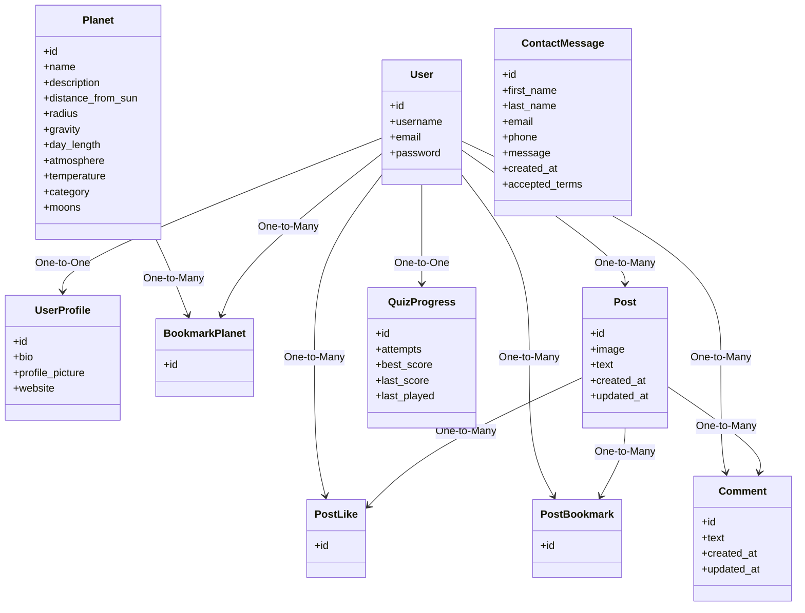

# Astronomy Beyond Learning (ABL)

## Project Description
Astronomy Beyond Learning (ABL) is an interactive astronomy platform designed for anyone interested in exploring space through a modern and engaging experience. The platform combines scientific information about planets, social interaction through posts and comments, and a quiz-based learning game. ABL aims to make space exploration enjoyable, accessible, and enriched with meaningful community participation.

---

## Problem Statement
Most astronomy platforms present static information without real interaction or community involvement. People interested in space often cannot find a platform that blends scientific knowledge with social engagement and interactive learning.

## Solution
Astronomy Beyond Learning (ABL) creates an interactive and community-focused environment where users can explore planets, share posts, interact through comments, and improve their knowledge through a quiz-based game. The platform enhances the learning experience by encouraging participation and connecting users through their shared interest in space, supported by a structured role-based moderation system.

---

# Features

## Planet Features
- View all planets with detailed scientific information.
- Planet attributes include category, description, distance, radius, gravity, temperature, atmosphere, and number of moons.
- Bookmark planets for quick access.
- Responsive and visually rich planet detail pages.

## Post Features
- Create posts containing **image and text only**.
- Edit and delete the user’s own posts only.
- Like posts created by other users.
- Bookmark posts.
- Comment on posts.
- Edit or delete the user’s own comments.

## User Profile Features
- View and edit personal profile information.
- Upload a profile picture.
- View the user’s own posts, likes, bookmarks, and comments.
- View quiz game results including best score, last score, and attempts.

## Game Features
- Astronomy quiz game.
- Tracks each user's best score, last score, and number of attempts.
- Results displayed in the user's profile page.

---

# Role-Based Permissions

## User
- Has access to all normal features such as creating posts, liking posts, bookmarking content, commenting, and editing their profile.

## Editor (Staff)
- Add new planets.
- Edit existing planets.
- Delete planets.
- Manage planet categories.
- **Cannot** edit or delete posts.
- **Cannot** view Contact Us messages.

## Moderator
- View all comments on the website.
- Delete harmful or inappropriate comments.
- View Contact Us messages.
- **Cannot** manage posts or planets.

## Admin
- Manage all users and assign roles.
- Manage all content across the platform.
- View all Contact Us messages.
- Full administrative access.

---

# User Stories

## Normal User
- Create an account, log in, and log out.
- Browse the homepage and view all planets.
- View planet details and bookmark planets.
- Create posts with image and text.
- Edit and delete their own posts only.
- Like and bookmark posts.
- Write comments on posts.
- Edit or delete their own comments.
- View and edit profile.
- View quiz game results inside the profile.

## Editor (Staff)
- Add, edit, and delete planets.
- Manage planet categories.
- Cannot edit or delete posts.
- Cannot view Contact Us messages.

## Moderator
- View all comments.
- Delete inappropriate comments.
- View Contact Us messages.
- Cannot edit posts or manage planets.

## Admin
- Manage all users and roles.
- Manage planetary and post content.
- View all Contact Us messages.
- Full access to Django admin.

